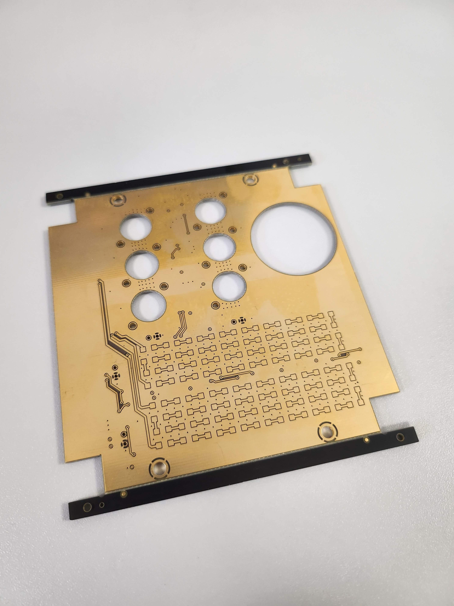

In 2k23 I completed a 6month internship at NiceCube, Lagrange labaratory in Nice. During my internship I worked on the electronics design and PCB development. In 6 months I designed, developed using KiCad and tested two boards presented below (Flash Panel Board) and (Flash Panel Control Board).

**Flash Panel Board**

Front Panel Board (FPB) is an electronics board composed of a set of visible and IR leds, in addition, it contains a cube mirror. The main goal of visible leds is to flash the light when the satellite is over the horizon, in order to facilitate satellite detection by the telescope. The main goal of the IR LEDs is to transmit information from space to earth. Finally, the main task of a cube mirror is to reflect an incoming laser light and reflect it back to the incoming point.

Front Panel Control Board (FPCB) is an electronics board which has as a main function to control the FPB.
The FPCB is composed of an STM32 microcontroller, step-down converter, overcurrent and overvoltage protection circuitry, step-up converters and LED modulation circuits. The FPCB is not a stand-alone control board, mainly because it receives mission mode commands from the OBC. 
 

